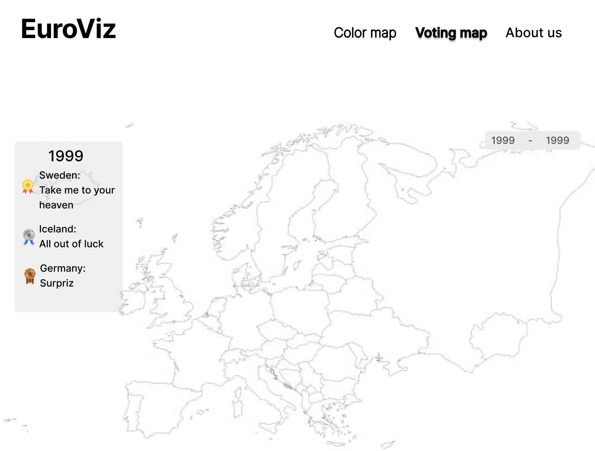
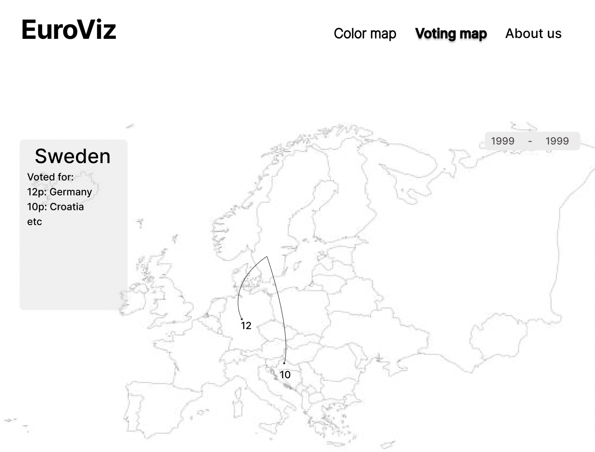
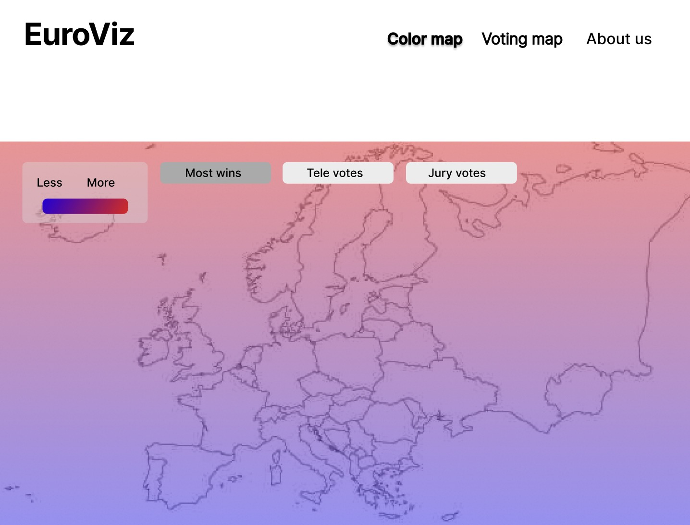

# Project of Data Visualization (COM-480)
Link to website: [EuroViz](https://com-480-data-visualization.github.io/EuroViz/)

| Student's name | SCIPER |
| -------------- | ------ |
| Linn Rågmo     | 404098 |
| Isac Hansson   | 404090 |
| William Frisk  | 404088 |

[Milestone 1](#milestone-1) • [Milestone 2](#milestone-2) • [Milestone 3](#milestone-3)

#### Guide to setup locally and intended usage is in the milestone 3 section 

## Milestone-1

**10% of the final grade**

This is a preliminary milestone to let you set up goals for your final project and assess the feasibility of your ideas.
Please, fill the following sections about your project.

_(max. 2000 characters per section)_

### Dataset

We’ve decided to use the following dataset with data on the Eurovision song contest: https://github.com/Spijkervet/eurovision-dataset. The dataset scrapes the following feature from the EurovisionWorld website and stores it in csv files:

Data on contestants:

- Contest year
- Country
- Country code
- Artist
- Song title
- Participated in semi final
- Order in semi final broadcast
- Order in final broadcast
- Place in final
- Score in final
- Place in semi-final
- Score in semi-final
- Televoting points in final
- Jury points in final
- Televoting points in semi-final
- Jury points in semi-final
- Song lyrics
- URL to youtube video

Data on votes:

- Contest year
- Round
- Country code that is giving the points
- Country code that is receiving the points
- Number of given points

Data on betting odds:

- Betting company name
- Betting score
- Year
- Performer
- Song
- Url of the bet
- Contest round
- Country name
- Country code

We estimate that the data will require relatively little data-cleaning / preprocessing since the main features we are interested in are already present in the dataset. However, we will need to tackle the fact that the rules of the competition have changed a bit over the years. For example, in 2004-2008 there was only one semi-final and televoting was introduced first in 2016. Further, the dataset contains NaN values and sometimes multiple values in a field which will need to be handled before the data can be visualised properly. We will also need to handle the fact that not every country has been competing at every instance of the competition.

### Problematic

With the dataset we want to effectively display the distribution of votes in the Eurovision Song Contest over time. One of the visualizations we plan to include is an interactive map that, by clicking on a certain country, shows how they voted and who voted for them. This interactive map will have different filters such as showing results for a certain year or an average over a time period, jury or televotes and received votes and submitted votes.

By doing this we aim to contribute to a deeper understanding of how different countries tend to vote. This is interesting due to a number of factors. For example, it would be interesting to see if voting tendencies align with preconceived notions about the countries' relationships. Another interesting thing we also want to visualize is the differences in jury points and televoting points which could provide quite interesting insights.

This visual aid for analysis is mainly targeted to Eurovision watchers and fans. The visualization will provide interesting information about the competition for people that are engaged with the competition. However, we also imagine that our visualizations could be used by tv channels and newspapers during the reporting of the current year’s competitions in Basel or competitions in future. This way reporters could provide a visual presentation of historic data about the competition to their audience.

### Exploratory Data Analysis

We spent some time pre-processing the data. Since the contest has been running since 1956, various changes have occurred, such as the number of participants, the introduction of semifinals, and evolving voting rules. These changes have led to sparse data with many null values, as some information is available only for certain years. To handle this, we structured our model by year so we can easily manage the differing conditions for each year. We merge the data of contestans and the data of the votes to create an object that we in the future could paginate our visualizations by year. The resulting object have the following structure:
```json
{
  ["year": [{
    "country": {
      "participated": Boolean, 
      "metadata": { 
        ...
      },
      "votes": {
        "total_votes": Number,
        "jury_votes": Number,
        "tele_votes": Number
      }
    }
  },]
,]}
```

 The data is collected from 1957-2023 and contains 54 different countries, which together account for 1,734 song entries. We have a lot of null values when the competition changes rules, for example fields like "Place in semi-final" and "Score in semi-final" are null for all years prior to the introduction of the semi-final rounds.

See further statistics and pre-processing [here](https://github.com/com-480-data-visualization/EuroViz/blob/master/pre-processing/stats.ipynb).
### Related work

This data has been used before to create visualizations about the contest. The previous work we have been able to find has presented, for example, data on participating countries, what makes a winning song and high-level overviews of country-country voting relations, see for example https://flourish.studio/blog/visualizing-eurovision-data/ and https://www.yellowfinbi.com/blog/data-visualization-shows-most-successful-eurovision-nations.

Our main visualization idea is to build a map of the contestants (countries) and analyze what each country votes on. We take inspiration from, for example, maps in elections which show voting results in different states or regions of a country, see https://edition.cnn.com/election/2024/electoral-college-map?game-id=2024-PG-CNN-ratings&game-view=map.

Our approach is original due to the fact that we combine the data about country vote statistics with the visualization approach of a geographic map. This way, even though the data has previously been used to get insights into voting patterns etc. we distinguish ourselves by providing a (to the extent of our research) novel visualization of it.

We have not explored the dataset in any other context besides this course.

## Milestone-2

**10% of the final grade**

### Resources

All of the lectures have provided us with a solid foundation in data visualization, enabling us to create our Eurovision map. However, the following are the most relevant:

- Lecture on Practical Maps: GeoJSON/TopoJSON to describe content of the geographical map and D3 projection for drag and zoom functionality
- Lecture on Perception and Color: The theory from the lecture will be used to create intuitive and effective data visualizations

### Goal

Our main goal is to implement an interactive map of Europe where users can click or hover over a country to show the top countries the selected country has voted for. The MVP just involves aggregating the total votes over all time or selecting a single contest year. See sketch below:



And after a country has been selected:



This core visualization can itself be broken down into independent parts to implement.

- We need to implement a map of Europe where we can select countries by clicking or hovering over them.
- We need to implement arrows that can go from a given start country to a given destination country on the map and change size (or similar) depending on votes.
- We also need to implement a selector for years that filters the data based on a given contest year.

However, this MVP can be developed into a more extensive visualization. Here are some stretch goals we aim for after the main visualization is complete:

- We would like for the user to be able to filter on a range of years instead of just a single year. That way the user could compare say 1960-1970 and 2000-2010 to see how it differs.
- We would also like some similar but different map visualizations where we color each country based on how many accumulative votes they’ve gotten over a range of years, how many times they won over a range of years and how many times they’ve finished last over a range of years. See sketch below (note that the colors would be on a country by country basis in the final version):

  

- Another interesting visualization to make would be a line or bar graph where the user could select two countries and we would show how much the two countries have voted for each other through history.

If there is even more time available to us we could move on from the vote and map part of the dataset and visualization and move on to analyzing other parts of the data. For example the lyrics of songs where we could analyze what languages tend to perform best or what words are most common in winning songs. This could be visualized quite simply in bar graphs. We could also graph differences in jury and televotes for countries by year.

## Milestone-3

# Setting Up the Project Locally

Follow these steps to set up and run the web application locally for development and testing.

---

### 1. Clone the Repository
```bash
git clone https://github.com/com-480-data-visualization/EuroViz.git
```
## Approach 1: *vscode with Live server*
### 2. Use Visual Studio Code
  We recommend using Visual Studio Code for running the webapp.
  Install the Live Server extension, which allows you to run the application with a local server to avoid CORS issues.
  https://marketplace.visualstudio.com/items?itemName=ritwickdey.LiveServer

### 3. Launch the Application 
 - Once Live Server is installed:
 - Open the project in Visual Studio Code.
 - Open the file webapp/index.html.
 - Right-click on the file tab and select "Open with Live Server".

  This will launch the web application in your browser.

  We use Live Server specifically to prevent CORS (Cross-Origin Resource Sharing) errors that occur when opening HTML files directly in the browser with Javascript

## Approach 2: *With Python*

### 2. Navigate into webapp
```bash
cd webapp
```
### 3. Run the server via python
```bash
python -m http.server
```
### 4. Open the port python used in your browser
*In out case:*
```bash
http://[::]:8000/
```

# Intended usage

The intended usage of our visualization is to explore how the distribution of points and votes has changed over the years in the finals of the Eurovision Song Contest.

#### Voting map
The user is first presented with the map we call the "Voting Map". This map represents how the votes were distributed from the different groups. The user can specify a year in the top right corner to update the map with data from that year. When the user has selected a year, they are presented with the top five winners from that year. The user can then choose whether to include all votes, telephone votes, or jury votes.

When a user clicks on a country, arrows are drawn from the selected country to the five countries that received the most votes from it. The info display in the left corner is also updated and shows all the votes the selected country gave away. The info display is interactive as well, so the user can click on a country in that list, and that country will be selected, triggering a redraw of the arrows.

While the arrows are still present, the user can change the voting type in the right corner for example, from jury votes to telephone votes and the application will redraw the arrows using the new data.
#### color map
Through the header, the user can navigate to the "Color Map." This choropleth map shows the point distribution across all countries that participated in the final, using a darker blue color for more points and a lighter blue for fewer points. This map gives the user a sense of whether a specific region of the participating countries received more points.

As with the "Voting Map" the user can select a specific year and voting type (total, jury, or telephone points), and the map will update accordingly.

The user could also click on the country to see the exact number of votes they got that year, and from the vote type.

#### Notes on the map pages
 - When a user selects the year 2020, they will see an empty map and a message in the info display stating that there is no data for this year. This is because Eurovision was paused due to the coronavirus pandemic
 - Jury votes and telephone votes are a relatively new feature introduced in the contest. If the user selects a year before 2016, the only available voting type is "Total votes/points."

#### About us
In the about us page the user gets a short introducion on the creators of the webapp.


